# Countries

## Officially Assigned

| Country | ISO 3166-1 alpha-2 | Flag Graphical Rules | Flag (National, State and Civil)
| - | - | - | -
| the Principality of Andorra | AD | [Normes Gràfiques (archive)](https://web.archive.org/web/20240819141156/https://www.ompa.ad/images/PDF/normativa-signes/Normes_Grafiques.pdf) <a href="https://commons.wikimedia.org/wiki/File:Flag_of_Andorra.svg">See page for author</a>, Public domain, via Wikimedia Commons | State:  No Civil Flag
| the United Arab Emirates | AE | [Protocals / The United Arab Emirates Flag](https://www.protocol.dubai.ae/ar/protocols-listing/protocols/the-united-arab-emirates-flag/) | National: 
| the Islamic Emirate of Afghanistan | AF (De facto) | [(Archive)](https://web.archive.org/web/20221229074727/https://www.alemarah.af/Afghanistan-Flag.png) <a href="https://commons.wikimedia.org/wiki/File:Flag_of_the_Taliban.svg">Original: Taliban Vector:  Lexicon</a>, Public domain, via Wikimedia Commons | National: 
| the Islamic Republic of Afghanistan | AF (De jure) | [Flag of Afghanistan \| Protocol (Archive)](https://web.archive.org/web/20210814090748/https://www.mfa.gov.af/protocol/flag-of-afghanistan.html) <a href="https://commons.wikimedia.org/wiki/File:Flag_of_Afghanistan_(2013%E2%80%932021).svg">See File history below for details.</a>, Public domain, via Wikimedia Commons <a href="https://commons.wikimedia.org/wiki/File:Flag_of_Afghanistan_(Colored_Emblem).svg">BlinxTheKitty</a>, CC0, via Wikimedia Commons | National:  
| Antigua and Barbuda | AG | Flag not clearly defined [Our National Symbols](https://ab.gov.ag/detail_page.php?page=27) [The Museum of Antigua and Barbuda's Facebook photo of the first sewn Antigua and Barbuda flag](https://www.facebook.com/ABMuseum/photos/a.10150414631098032/10162160607288032/?_rdr) [Local Antigua Website](https://antiguanice.com/client.php?id=461&cat=38)| National: 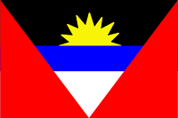  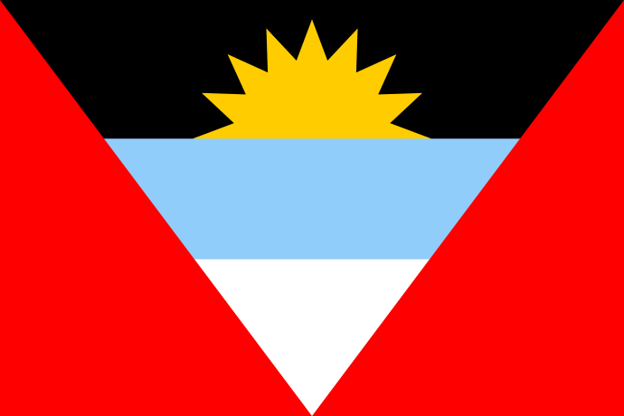
| Anguilla | AI | UK flag not clearly defined. Text says the seal on the flag has dolphins but Images show that the seal on the flag has fish. [Former Anguilla Government Website (Archive)](https://web.archive.org/web/20210415110050/http://www.gov.ai/flags.php) <a href="https://commons.wikimedia.org/wiki/File:Flag_of_Anguilla.svg">Dbenbenn; Vectorization:  Froztbyte</a>, CC0, via Wikimedia Commons | National: 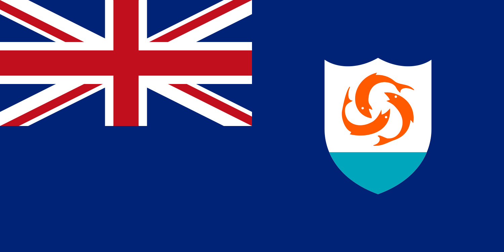 
| the Republic of Albania | AL | [Law #8926, 22.07.2002](https://upload.wikimedia.org/wikipedia/commons/d/d6/Ligji_8926_22.07.2002.pdf) Image in document is cropped weirdly, symbol assumed to be 1/3rds width. <a href="https://commons.wikimedia.org/wiki/File:Flag_of_Albania.svg">Sadik Kaceli</a>, Public domain, via Wikimedia Commons | National: 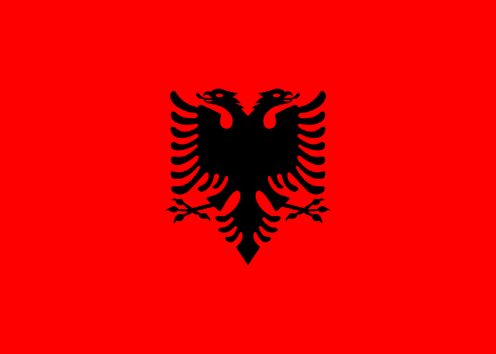
| the Republic of Armenia | AM | [ՀՍՏ 50-2012 ՀԱՅԱՍՏԱՆԻ ԱԶԳԱՅԻՆ ՍՏԱՆԴԱՐՏ](http://yeraguyn.com/wp-content/uploads/2010/04/HST-50-2012.pdf) | National: 
| the Republic of Angola | AO | [REPU'BLICA DE ANGOLA SI'MBOLOS NACIONAIS DA REPU'BLICA DE ANGOLA Manual de Normas Gra'ficas e Protocolares](https://web.archive.org/web/20190901222558/https://www.governo.gov.ao/download.aspx?id=1728&tipo=publicacao) Document uses pure red and yellow. <a href="https://commons.wikimedia.org/wiki/File:Flag_of_Angola.svg">User:SKopp</a>, Public domain, via Wikimedia Commons | National: 
| Antarctica | AQ | No official flag, just proposals.
| the Argentine Republic | AR | [NORMA IRAM-DEF D 7679: 2002 Bandera Argentina de ceremonia Características](http://manuelbelgrano.gov.ar/wp-content/uploads/2013/10/IRAM_7679_2002.pdf) [NORMA IRAM-DEF D 7677: 2002 Bandera Argentina de izar Características](http://manuelbelgrano.gov.ar/wp-content/uploads/2013/10/IRAM_7677_2002.pdf) [NORMA IRAM-DEF D 7675: 2003 Bandera Argentina de ceremonia Accesorios](https://mininterior.gob.ar/asuntospoliticos/pdf_/iram-7675-2003.pdf) [NORMA IRAM-DEF D 7674: 2004 Bandera Argentina Características de su confección](https://www.mininterior.gob.ar/asuntospoliticos/pdf_/iram-7674-2004.pdf) <a href="https://commons.wikimedia.org/wiki/File:Flag_of_Argentina.svg">See File history below for details.</a>, Public domain, via Wikimedia Commons | National: 
| American Samoa | AS
| the Republic of Austria | AT
| the Commonwealth of Australia | AU
| the Country of Aruba | AW
| Åland | AX
| the Republic of Azerbaijan | AZ
| Bosnia and Herzegovina | BA
| Barbados | BB
| the People's Republic of Bangladesh | BD
| the Kingdom of Belgium | BE
| Burkina Faso | BF
| the Republic of Bulgaria | BG
| the Kingdom of Bahrain | BH
| the Republic of Burundi | BI
| the Republic of Benin | BJ
| the Collectivity of Saint-Barthélemy | BL
| Bermuda | BM
| Brunei Darussalam | BN
| the Plurinational State of Bolivia | BO
| Bonaire, Sint Eustatius and Saba | BQ
| the Federative Republic of Brazil | BR
| the Commonwealth of The Bahamas | BS
| the Kingdom of Bhutan | BT
| Bouvet Island | BV
| the Republic of Botswana | BW
| the Republic of Belarus | BY
| Belize | BZ
| Canada | CA
| the Territory of Cocos (Keeling) Islands | CC
| the Democratic Republic of the Congo | CD
| the Central African Republic | CF
| the Republic of the Congo | CG
| the Swiss Confederation | CH
| the Republic of Côte d'Ivoire | CI
| the Cook Islands | CK
| the Republic of Chile | CL
| the Republic of Cameroon | CM
| the People's Republic of China | CN
| the Republic of Colombia | CO
| the Republic of Costa Rica | CR
| the Republic of Cuba | CU
| the Republic of Cabo Verde | CV
| the Country of Curaçao | CW
| the Territory of Christmas Island | CX
| the Republic of Cyprus | CY
| the Czech Republic | CZ
| the Federal Republic of Germany | DE
| the Republic of Djibouti | DJ
| the Kingdom of Denmark | DK
| the Commonwealth of Dominica | DM
| the Dominican Republic | DO
| the People's Democratic Republic of Algeria | DZ
| the Republic of Ecuador | EC
| the Republic of Estonia | EE
| the Arab Republic of Egypt | EG
| the Sahrawi Arab Democratic Republic | EH
| the State of Eritrea | ER
| the Kingdom of Spain | ES
| the Federal Democratic Republic of Ethiopia | ET
| the Republic of Finland | FI
| the Republic of Fiji | FJ
| the Falkland Islands | FK
| the Federated States of Micronesia | FM
| the Faroe Islands | FO
| the French Republic | FR
| the Gabonese Republic | GA
| the United Kingdom of Great Britain and Northern Ireland | GB
| Grenada | GD
| Georgia | GE
| Guyane | GF
| the Bailiwick of Guernsey | GG
| the Republic of Ghana | GH
| Gibraltar | GI
| Greenland | GL
| the Republic of The Gambia | GM
| the Republic of Guinea | GN
| Guadeloupe | GP
| the Republic of Equatorial Guinea | GQ
| the Hellenic Republic | GR
| South Georgia and the South Sandwich Islands | GS
| the Republic of Guatemala | GT
| Guam | GU
| the Republic of Guinea-Bissau | GW
| the Co-operative Republic of Guyana | GY
| the Hong Kong Special Administrative Region of China | HK
| the Territory of Heard Island and McDonald Islands | HM
| the Republic of Honduras | HN
| the Republic of Croatia | HR
| the Republic of Haiti | HT
| Hungary | HU
| the Republic of Indonesia | ID
| Ireland | IE
| the State of Israel | IL
| the Isle of Man | IM
| the Republic of India | IN
| the British Indian Ocean Territory | IO
| the Republic of Iraq | IQ
| the Islamic Republic of Iran | IR
| Iceland | IS
| the Italian Republic | IT
| the Bailiwick of Jersey | JE
| Jamaica | JM
| the Hashemite Kingdom of Jordan | JO
| Japan | JP
| the Republic of Kenya | KE
| the Kyrgyz Republic | KG
| the Kingdom of Cambodia | KH
| the Republic of Kiribati | KI
| the Union of the Comoros | KM
| the Federation of Saint Kitts and Nevis | KN
| the Democratic People's Republic of Korea | KP
| the Republic of Korea | KR
| the State of Kuwait | KW
| the Cayman Islands | KY
| the Republic of Kazakhstan | KZ
| the Lao People's Democratic Republic | LA
| the Lebanese Republic | LB
| Saint Lucia | LC
| the Principality of Liechtenstein | LI
| the Democratic Socialist Republic of Sri Lanka | LK
| the Republic of Liberia | LR
| the Kingdom of Lesotho | LS
| the Republic of Lithuania | LT
| the Grand Duchy of Luxembourg | LU
| the Republic of Latvia | LV
| the State of Libya | LY
| the Kingdom of Morocco | MA
| the Principality of Monaco | MC
| the Republic of Moldova | MD
| Montenegro | ME
| the Collectivity of Saint-Martin | MF
| the Republic of Madagascar | MG
| the Republic of the Marshall Islands | MH
| the Republic of North Macedonia | MK
| the Republic of Mali | ML
| the Republic of the Union of Myanmar | MM
| Mongolia | MN
| the Macao Special Administrative Region of China | MO
| the Commonwealth of the Northern Mariana Islands | MP
| Martinique | MQ
| the Islamic Republic of Mauritania | MR
| Montserrat | MS
| the Republic of Malta | MT
| the Republic of Mauritius | MU
| the Republic of Maldives | MV
| the Republic of Malawi | MW
| the United Mexican States | MX
| Malaysia | MY
| the Republic of Mozambique | MZ
| the Republic of Namibia | NA
| New Caledonia | NC
| the Republic of the Niger | NE
| the Territory of Norfolk Island | NF
| the Federal Republic of Nigeria | NG
| the Republic of Nicaragua | NI
| the Kingdom of the Netherlands | NL
| the Kingdom of Norway | NO
| the Federal Democratic Republic of Nepal | NP
| the Republic of Nauru | NR
| Niue | NU
| New Zealand | NZ
| the Sultanate of Oman | OM
| the Republic of Panama | PA
| the Republic of Peru | PE
| Overseas Lands of French Polynesia | PF
| the Independent State of Papua New Guinea | PG
| the Republic of the Philippines | PH
| the Islamic Republic of Pakistan | PK
| the Republic of Poland | PL
| the Overseas Collectivity of Saint-Pierre and Miquelon | PM
| the Pitcairn, Henderson, Ducie and Oeno Islands | PN
| the Commonwealth of Puerto Rico | PR
| the State of Palestine | PS
| the Portuguese Republic | PT
| the Republic of Palau | PW
| the Republic of Paraguay | PY
| the State of Qatar | QA
| Réunion | RE
| Romania | RO
| the Republic of Serbia | RS
| the Russian Federation | RU
| the Republic of Rwanda | RW
| the Kingdom of Saudi Arabia | SA
| the Solomon Islands | SB
| the Republic of Seychelles | SC
| the Republic of the Sudan | SD
| the Kingdom of Sweden | SE
| the Republic of Singapore | SG
| Saint Helena, Ascension and Tristan da Cunha | SH
| the Republic of Slovenia | SI
| Svalbard and Jan Mayen | SJ
| the Slovak Republic | SK
| the Republic of Sierra Leone | SL
| the Republic of San Marino | SM
| the Republic of Senegal | SN
| the Federal Republic of Somalia | SO
| the Republic of Suriname | SR
| the Republic of South Sudan | SS
| the Democratic Republic of São Tomé and Príncipe | ST
| the Republic of El Salvador | SV
| Sint Maarten | SX
| the Syrian Arab Republic | SY
| the Kingdom of Eswatini | SZ
| the Turks and Caicos Islands | TC
| the Republic of Chad | TD
| the French Southern and Antarctic Lands | TF
| the Togolese Republic | TG
| the Kingdom of Thailand | TH
| the Republic of Tajikistan | TJ
| Tokelau | TK
| the Democratic Republic of Timor-Leste | TL
| Turkmenistan | TM
| the Republic of Tunisia | TN
| the Kingdom of Tonga | TO
| the Republic of Türkiye | TR
| the Republic of Trinidad and Tobago | TT
| Tuvalu | TV
| the Republic of China | TW
| the United Republic of Tanzania | TZ
| Ukraine | UA
| the Republic of Uganda | UG
| United States Pacific Island Wildlife Refuges, Navassa Island, and Wake Island | UM
| the United States of America | US
| the Oriental Republic of Uruguay | UY
| the Republic of Uzbekistan | UZ
| the Holy See | VA
| Saint Vincent and the Grenadines | VC
| the Bolivarian Republic of Venezuela | VE
| the Virgin Islands | VG
| the Virgin Islands of the United States | VI
| the Socialist Republic of Viet Nam | VN
| the Republic of Vanuatu | VU
| the Territory of the Wallis and Futuna Islands | WF
| the Independent State of Samoa | WS
| the Republic of Yemen | YE
| the Department of Mayotte | YT
| the Republic of South Africa | ZA
| the Republic of Zambia | ZM
| the Republic of Zimbabwe | ZW

## Exceptional Reserved

| Country | ISO 3166-1 alpha-2 | Flag Graphical Rules | Flag (National, State and Civil)
| - | - | - | -
| Ascension Island | AC
| Clipperton Island | CP
| Sark | CQ
| Diego Garcia | DG
| Ceuta, Melilla | EA
| the European Union | EU
| the Eurozone | EZ
| Metropolitan France | FX
| the Canary Islands | IC
| the Union of Soviet Socialist Republics | SU
| Tristan da Cunha | TA
| the United Kingdom of Great Britain and Northern Ireland | UK
| the United Nations | UN

## Commonly Assigned

| Country | ISO 3166-1 alpha-2 | Flag Graphical Rules | Flag (National, State and Civil)
| - | - | - | -
| the Republic of Kosovo | XK

## User Assigned

| Country | ISO 3166-1 alpha-2 | Flag Graphical Rules | Flag (National, State and Civil)
| - | - | - | -
| the Republic of Abkhazia | XA (Used by Russia)
| the Republic of South Ossetia | XO (Used by Russia)

## No Code

| Country | ISO 3166-1 alpha-2 | Flag Graphical Rules | Flag (National, State and Civil)
| - | - | - | -
| the Turkish Republic of Northern Cyprus | (CT.TR, used by Turkey)
| the Republic of Somaliland
| the Sovereign Military Hospitaller Order of Saint John of Jerusalem, of Rhodes and of Malta
| the Pridnestrovian Moldavian Republic (Transnistria)

## Subdivisions (More reliable sources needed)

### Officially Assigned Subdivisions

| Country | ISO 3166-1 alpha-2 | Flag Exists? | Flag (National, State and Civil)
| - | - | - | -
| Canillo | AD-02 | No flag or Needs Evidence of a Flag
| Encamp | AD-03 | No flag or Needs Evidence of a Flag
| La Massana | AD-04 | No flag or Needs Evidence of a Flag
| Ordino | AD-05 | No flag or Needs Evidence of a Flag
| Sant Julià de Lòria | AD-06 | No flag or Needs Evidence of a Flag
| Andorra la Vella | AD-07 | No flag or Needs Evidence of a Flag
| Escaldes-Engordany | AD-08 | No flag or Needs Evidence of a Flag
| ‘Ajmān | AE-AJ | [Coat of Arms on the Ajman Museum](https://upload.wikimedia.org/wikipedia/commons/1/1b/The_Ajman_National_Museum_%28Emirate_of_Ajman_UAE%29_-_panoramio.jpg) | 
| Abū Z̧aby | AE-AZ | [1969 Stamp](https://upload.wikimedia.org/wikipedia/commons/e/e9/Stamp_of_Abu_Dhabi_-_1969_-_Colnect_625777_-_1_-_National_Flag_-_Surcharged.jpeg) | 
| al-Fujayrah | AE-FU | No flag (Needs Evidence of no Flag)
| Ash Shāriqah | AE-SH | [1963 Stamp](https://upload.wikimedia.org/wikipedia/commons/0/03/Sharjah1963-65nosheikh.jpg) | 
| Dubayy | AE-DU | [Dubai Museum](https://maps.app.goo.gl/Sv3gvhUw7BJ3HxRk7), [Front flag may be 3:5 instead of 1:2](https://maps.app.goo.gl/259qn6iPDgUmj7xt7). |  
| Ra’s al-Khaymah | AE-RK | [Image of flag (Archive)](https://web.archive.org/web/20070314033218/https://www.emirates-islands.org.ae/images/PICS/18.JPG) | 
| Umm al-Qaywayn | AE-UQ | Flag not clearly defined [Old car license plates](https://upload.wikimedia.org/wikipedia/commons/1/16/Antiguas_patentes_de_autos_de_Umm_al-Qaywayn%2C_de_la_%C3%A9poca_del_protectorado_brit%C3%A1nico.jpg), [Old passport](https://upload.wikimedia.org/wikipedia/commons/8/8e/Antiguo_pasaporte_del_emirato_de_Umm_al-Qaywayn%3B_%C3%A9poca_del_protectora_brit%C3%A1nico.jpg) |     
| Badakhshān | AF-BDS | No flag or Needs Evidence of a Flag
| Bādghīs | AF-BDG | No flag or Needs Evidence of a Flag
| Baghlān | AF-BGL | No flag or Needs Evidence of a Flag
| Balkh | AF-BAL | No flag or Needs Evidence of a Flag
| Bāmyān | AF-BAM | No flag or Needs Evidence of a Flag
| Dāykundī | AF-DAY | No flag or Needs Evidence of a Flag
| Farāh | AF-FRA | No flag or Needs Evidence of a Flag
| Fāryāb | AF-FYB | No flag or Needs Evidence of a Flag
| Ghaznī | AF-GHA | No flag or Needs Evidence of a Flag
| Ghōr | AF-GHO | No flag or Needs Evidence of a Flag
| Helmand | AF-HEL | No flag or Needs Evidence of a Flag
| Herāt | AF-HER | No flag or Needs Evidence of a Flag
| Jowzjān | AF-JOW | No flag or Needs Evidence of a Flag
| Kābul | AF-KAB | No flag or Needs Evidence of a Flag
| Kandahār | AF-KAN | No flag or Needs Evidence of a Flag
| Kāpīsā | AF-KAP | No flag or Needs Evidence of a Flag
| Khōst | AF-KHO | No flag or Needs Evidence of a Flag
| Kunaṟ | AF-KNR | No flag or Needs Evidence of a Flag
| Kunduz | AF-KDZ | No flag or Needs Evidence of a Flag
| Laghmān | AF-LAG | No flag or Needs Evidence of a Flag
| Lōgar | AF-LOG | No flag or Needs Evidence of a Flag
| Nangarhār | AF-NAN | No flag or Needs Evidence of a Flag
| Nīmrōz | AF-NIM | No flag or Needs Evidence of a Flag
| Nūristān | AF-NUR | No flag or Needs Evidence of a Flag
| Paktīkā | AF-PKA | No flag or Needs Evidence of a Flag
| Paktiyā | AF-PIA | No flag or Needs Evidence of a Flag
| Panjshayr | AF-PAN | No flag or Needs Evidence of a Flag
| Parwān | AF-PAR | No flag or Needs Evidence of a Flag
| Samangān | AF-SAM | No flag or Needs Evidence of a Flag
| Sar-e Pul | AF-SAR | No flag or Needs Evidence of a Flag
| Takhār | AF-TAK | No flag or Needs Evidence of a Flag
| Uruzgān | AF-URU | No flag or Needs Evidence of a Flag
| Wardak | AF-WAR | No flag or Needs Evidence of a Flag
| Zābul | AF-ZAB | No flag or Needs Evidence of a Flag
| Saint George | AG-03 | No flag or Needs Evidence of a Flag
| Saint John | AG-04 | No flag or Needs Evidence of a Flag
| Saint Mary | AG-05 | No flag or Needs Evidence of a Flag
| Saint Paul | AG-06 | No flag or Needs Evidence of a Flag
| Saint Peter | AG-07 | No flag or Needs Evidence of a Flag
| Saint Philip | AG-08 | No flag or Needs Evidence of a Flag
| Barbuda | AG-10 | Barbuda Council flag not counted, No flag or Needs Evidence of a Flag
| Redonda | AG-11 | Kingdom of Redonda flag not counted, No flag or Needs Evidence of a Flag
| Berat | AL-01 | Needs Evidence of a Flag, Image based on description only. <a href="https://commons.wikimedia.org/wiki/File:Flag_of_Berat.svg">JavacBenny</a>, Public domain, via Wikimedia Commons | 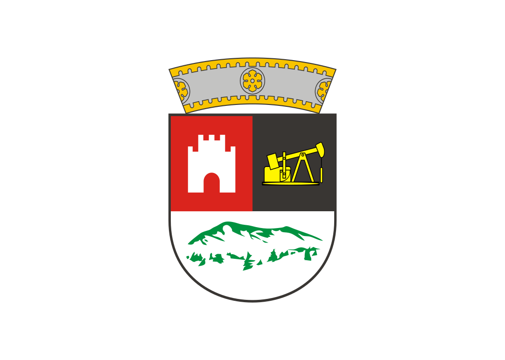
| Durrës | AL-02 | [Photo of Flag (Archive)](https://web.archive.org/web/20200826083308/https://albeu.com/dokumenta/foto/dorehiqet_bekteshi.jpg) Albanian Flag ratios used. <a href="https://commons.wikimedia.org/wiki/File:Flag_of_Durr%C3%ABs.svg">JavacBenny</a>, Public domain, via Wikimedia Commons | 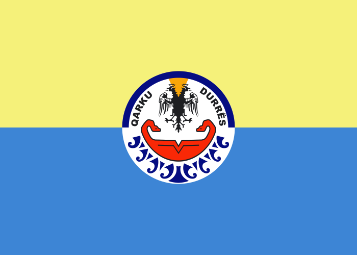
| Elbasan | AL-03 | No flag or Needs Evidence of a Flag
| Fier | AL-04 | No flag or Needs Evidence of a Flag
| Gjirokastër | AL-05 | [Photo of Flag](https://www.crwflags.com/fotw/images/a/al-gj.jpg) <a href="https://commons.wikimedia.org/wiki/File:Stema_e_Qarkut_Gjirokast%C3%ABr.svg">Vectorized by Kj1595</a>, Public domain, via Wikimedia Commons | 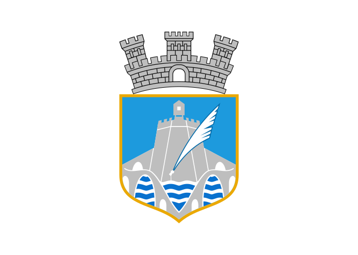
| Korçë | AL-06 | [Photo of Flag (Unclear)](https://www.korcaregion.com/foto/ana_verushi_kryetare_qarku_korce.jpg) Albanian Flag ratios used. <a href="https://commons.wikimedia.org/wiki/File:Flag_of_Kor%C3%A7%C3%AB.svg">JavacBenny</a>, Public domain, via Wikimedia Commons | 
| Kukës | AL-07 | [Photo of Flag (Archive)](https://web.archive.org/web/20200826083308/https://albeu.com/dokumenta/foto/dorehiqet_bekteshi.jpg) Albanian Flag ratios used. <a href="https://commons.wikimedia.org/wiki/File:Flag_of_Kuk%C3%ABs.svg">JavacBenny</a>, Public domain, via Wikimedia Commons | 
| Lezhë | AL-08 | [Official Facebook Account](https://www.facebook.com/photo/?fbid=2003128826488535&set=pcb.2003129549821796) Emblem has changed since the photo has taken and thus uses the updated one. Flag may be still using the old emblem. <a href="https://commons.wikimedia.org/wiki/File:Stema_e_Qarkut_Lezh%C3%AB.svg">Vectorized by Kj1595</a>, Public domain, via Wikimedia Commons | 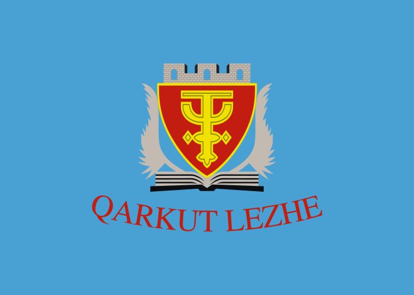
| Dibër | AL-09 | [Photo of Flag](https://qarkudiber.gov.al/sot-me-date-27-12-2024-ne-ambientet-e-keshillit-te-qarkut-u-zhvillua-mbledhja-e-keshillit/) | 
| Shkodër | AL-10 | [Photo of Flag](https://qarkushkoder.gov.al/31-12-2024/) | 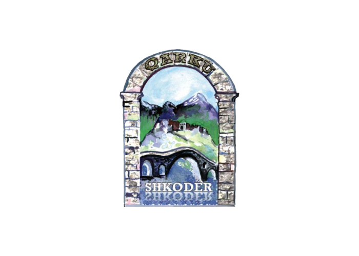
| Tiranë | AL-11 | [Photo of Flag](http://1.bp.blogspot.com/-X6wNelyy_jw/UK_QNXnzBNI/AAAAAAAAAp0/JS0mYc-30v8/s1600/IMG_1453.JPG) Albanian Flag ratios used. <a href="https://commons.wikimedia.org/wiki/File:Stema_e_Qarkut_Tiran%C3%AB.svg">Vectorized by Kj1595</a>, Public domain, via Wikimedia Commons | 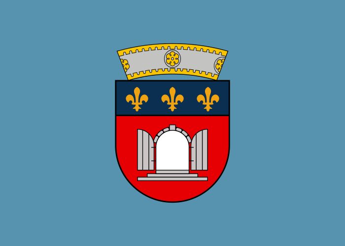
| Vlorë | AL-12 | [Photo of Flag](https://i.ytimg.com/vi/AM1i8rWXcXc/maxresdefault.jpg) <a href="https://commons.wikimedia.org/wiki/File:Flag_of_Vlor%C3%AB.svg">JavacBenny</a>, Public domain, via Wikimedia Commons | 
| Aragac̣otn | AM-AG | No flag or Needs Evidence of a Flag
| Ararat | AM-AR | No flag or Needs Evidence of a Flag
| Armavir | AM-AV | No flag or Needs Evidence of a Flag
| Erevan | AM-ER | [Flag (Archive)](https://web.archive.org/web/20111002075052/http://www.yerevan.am/main.php?lang=1&page_id=114) <a href="https://commons.wikimedia.org/wiki/File:Flag_of_Yerevan.svg">City of Yerevan</a>, Public domain, via Wikimedia Commons | 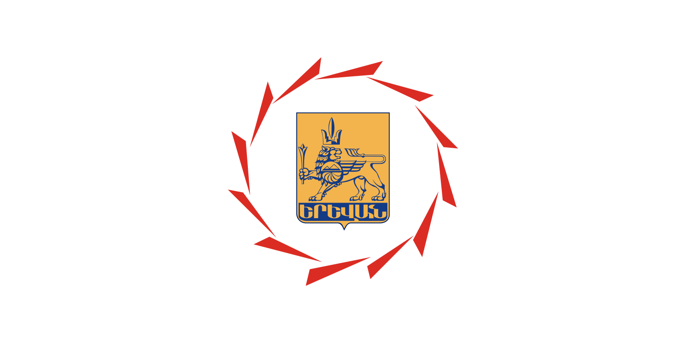
| Geġark'unik' | AM-GR | No flag or Needs Evidence of a Flag
| Kotayk' | AM-KT | No flag or Needs Evidence of a Flag
| Loṙi | AM-LO | No flag or Needs Evidence of a Flag
| Širak | AM-SH | No flag or Needs Evidence of a Flag
| Syunik' | AM-SU | No flag or Needs Evidence of a Flag
| Tavuš | AM-TV | No flag or Needs Evidence of a Flag
| Vayoć Jor | AM-VD | No flag or Needs Evidence of a Flag
| Bengo | AO-BGO | No flag or Needs Evidence of a Flag
| Benguela | AO-BGU | No flag or Needs Evidence of a Flag
| Bié | AO-BIE | No flag or Needs Evidence of a Flag
| Cabinda | AO-CAB | Republic of Cabinda flag not counted, No flag or Needs Evidence of a Flag
| Cuando Cubango | AO-CCU | No flag or Needs Evidence of a Flag
| Cuanza-Norte | AO-CNO | No flag or Needs Evidence of a Flag
| Cuanza-Sul | AO-CUS | No flag or Needs Evidence of a Flag
| Cunene | AO-CNN | No flag or Needs Evidence of a Flag
| Huambo | AO-HUA | No flag or Needs Evidence of a Flag
| Huíla | AO-HUI | No flag or Needs Evidence of a Flag
| Luanda | AO-LUA | No flag or Needs Evidence of a Flag
| Lunda-Norte | AO-LNO | No flag or Needs Evidence of a Flag
| Lunda-Sul | AO-LSU | No flag or Needs Evidence of a Flag
| Malange | AO-MAL | No flag or Needs Evidence of a Flag
| Moxico | AO-MOX | No flag or Needs Evidence of a Flag
| Namibe | AO-NAM | No flag or Needs Evidence of a Flag
| Uíge | AO-UIG | No flag or Needs Evidence of a Flag
| Zaire | AO-ZAI | No flag or Needs Evidence of a Flag
| Salta | AR-A | [Bandera de la Provincia de Salta](https://www.salta.gob.ar/contenidos/bandera-de-la-provincia-de-salta-4) [PLIEGO DE BASES Y CONDICIONES PARTICULARES](https://www.senado.gob.ar/administrativo/6498/6815/downloadLicitacion) | 
| Buenos Aires | AR-B | [XXIII° ANIVERSARIO DE LA BANDERA DE LA PROVINCIA DE BUENOS AIRES](https://policia.mseg.gba.gov.ar/gacetilla_policial/Noviembre2020/20-11-20b.html) [PLIEGO DE BASES Y CONDICIONES PARTICULARES](https://www.senado.gob.ar/administrativo/6498/6815/downloadLicitacion) <a href="https://commons.wikimedia.org/wiki/File:Bandera_de_la_Provincia_de_Buenos_Aires_3.svg">Matías Hiribarne, Facundo Bailo, Ignacio Rossi, Esteban Carrasco and Fernando Barroso (Vector graphics image by  Starchild)</a>, <a href="https://creativecommons.org/licenses/by/4.0">CC BY 4.0</a>, via Wikimedia Commons (Modified) | 
| Ciudad Autónoma de Buenos Aires | AR-C | [Bandera de La Ciudad](https://buenosaires.gob.ar/laciudad/simbolos-de-la-ciudad/bandera-de-la-ciudad) [PLIEGO DE BASES Y CONDICIONES PARTICULARES](https://www.senado.gob.ar/administrativo/6498/6815/downloadLicitacion) Used image that was attached. Sheld takes 1/3rd width as size was not defined. | 
| San Luis | AR-D | Flag not clearly defined [PLIEGO DE BASES Y CONDICIONES PARTICULARES](https://www.senado.gob.ar/administrativo/6498/6815/downloadLicitacion) [Ley Nº II-0030-2004 (5439)](https://diputados.sanluis.gob.ar/diputadosasp/paginas/verNorma.asp?NormaID=56) <a href="https://commons.wikimedia.org/wiki/File:Escudo_de_Armas_de_la_Provincia_de_San_Luis_.jpg">Presidente de la Nación Argentina &amp; Congreso de la Nación Argentina</a>, Public domain, via Wikimedia Commons | 
| Entre Ríos | AR-E | [PLIEGO DE BASES Y CONDICIONES PARTICULARES](https://www.senado.gob.ar/administrativo/6498/6815/downloadLicitacion) [Ley 9385 de Creación de la Bandera de Entre Ríos - Foja 1](https://upload.wikimedia.org/wikipedia/commons/8/8f/Ley_9385_de_Creaci%C3%B3n_de_la_Bandera_de_Entre_R%C3%ADos_-_Foja_1.jpg) <a href="https://commons.wikimedia.org/wiki/File:Ley_9385_de_Creaci%C3%B3n_de_la_Bandera_de_Entre_R%C3%ADos_-_Foja_1.jpg">Claudia Patricia Sánchez</a>, CC0, via Wikimedia Commons [Antiguo E Ríos Historia 1956 Escudo Planos Lote Mag 61369 (Usado)](https://articulo.mercadolibre.com.ar/MLA-1399006533-antiguo-e-rios-historia-1956-escudo-planos-lote-mag-61369-_JM) <a href="https://commons.wikimedia.org/wiki/File:State_Flag_of_Entre_Rios.svg">FOTWAngelfire</a>, Public domain, via Wikimedia Commons |  
| La Rioja | AR-F | [PLIEGO DE BASES Y CONDICIONES PARTICULARES](https://www.senado.gob.ar/administrativo/6498/6815/downloadLicitacion) <a href="https://commons.wikimedia.org/wiki/File:Bandera_de_la_Provincia_de_La_Rioja.svg">Goverment of La Rioja Province (vector graphics by: Lu1g1-ktupq).</a>, Public domain, via Wikimedia Commons | 
| Santiago del Estero | AR-G | [Vigente, de alcance general 1985-10-11](https://www.argentina.gob.ar/normativa/provincial/ley-5535-123456789-0abc-defg-535-5000gvorpyel/actualizacion) Red not defined. <a href="https://commons.wikimedia.org/wiki/File:Symbol_of_Santiago_del_Estero.svg">Deritative work of </a>, Government of Santiago del Estero (vector graphics by Guilherme Paula)</a>, Public domain, via Wikimedia Commons | 
| Chaco | AR-H | [LICITACIÓN PÚBLICA ART. 11-26-2022, ADQUISICION DE BANDERAS DE CEREMONIA](https://www.senado.gob.ar/administrativo/6498/6815/downloadLicitacion) Green not defined. "Veinticinco estrellas de cinco puntas, circundando el arado, tendrán una medida resultante comprendida entre los 0.25m del margen derecho y 0,08 del margen izquierdo." whar <a href="https://commons.wikimedia.org/wiki/File:Bandera_de_la_Provincia_del_Chaco.svg">Mario Gadotti, whose work was chosen after a contest organized by the Government of Chaco to adopt an emblem.[1]  (Vector graphics image by Lu1g1-ktupq) This W3C-unspecified vector image was created with Inkscape .</a>, <a href="https://creativecommons.org/licenses/by/4.0">CC BY 4.0</a>, via Wikimedia Commons Modified. | 
| San Juan | AR-J | [Sergio Uñac. Gobernador de la Provincia de San Juan 2015-2023](https://www.sanjuanalmundo.com/articulo?id=332058) <a href="https://commons.wikimedia.org/wiki/File:Flag_of_the_San_Juan_Province.svg">Borja Toranzo de Zavalla, Jacinta Angulo de Rojo, and Félix de la Roza de Junco</a>, Public domain, via Wikimedia Commons <a href="https://commons.wikimedia.org/wiki/File:Flag_of_the_San_Juan_Province_(reverse).svg">SVG based on this fileFlags of the World</a>, <a href="https://creativecommons.org/licenses/by/4.0">CC BY 4.0</a>, via Wikimedia Commons Modified. |  
| Catamarca | AR-K | [LICITACIÓN PÚBLICA ART. 11-26-2022, ADQUISICION DE BANDERAS DE CEREMONIA](https://www.senado.gob.ar/administrativo/6498/6815/downloadLicitacion) <a href="https://commons.wikimedia.org/wiki/File:Bandera_de_la_Provincia_de_Catamarca.svg">Fabián Martinena[1]  (Vector graphics image by 3188a)</a>, <a href="https://creativecommons.org/licenses/by/4.0">CC BY 4.0</a>, via Wikimedia Commons Modified. | 
| La Pampa | AR-L | [LICITACIÓN PÚBLICA ART. 11-26-2022, ADQUISICION DE BANDERAS DE CEREMONIA](https://www.senado.gob.ar/administrativo/6498/6815/downloadLicitacion) <a href="https://commons.wikimedia.org/wiki/File:Escudo_de_la_Provincia_de_La_Pampa.svg">Juan Olsina</a>, <a href="https://creativecommons.org/licenses/by/4.0">CC BY 4.0</a>, via Wikimedia Commons I dont know if just minifying & adding it to a flag counts a modification, but if it does, Modified. | 
| Mendoza | AR-M | i'll do it later
| Misiones | AR-N
| Formosa | AR-P
| Neuquén | AR-Q
| Río Negro | AR-R
| Santa Fe | AR-S
| Tucumán | AR-T
| Chubut | AR-U
| Tierra del Fuego | AR-V
| Corrientes | AR-W
| Córdoba | AR-X
| Jujuy | AR-Y
| Santa Cruz | AR-Z
