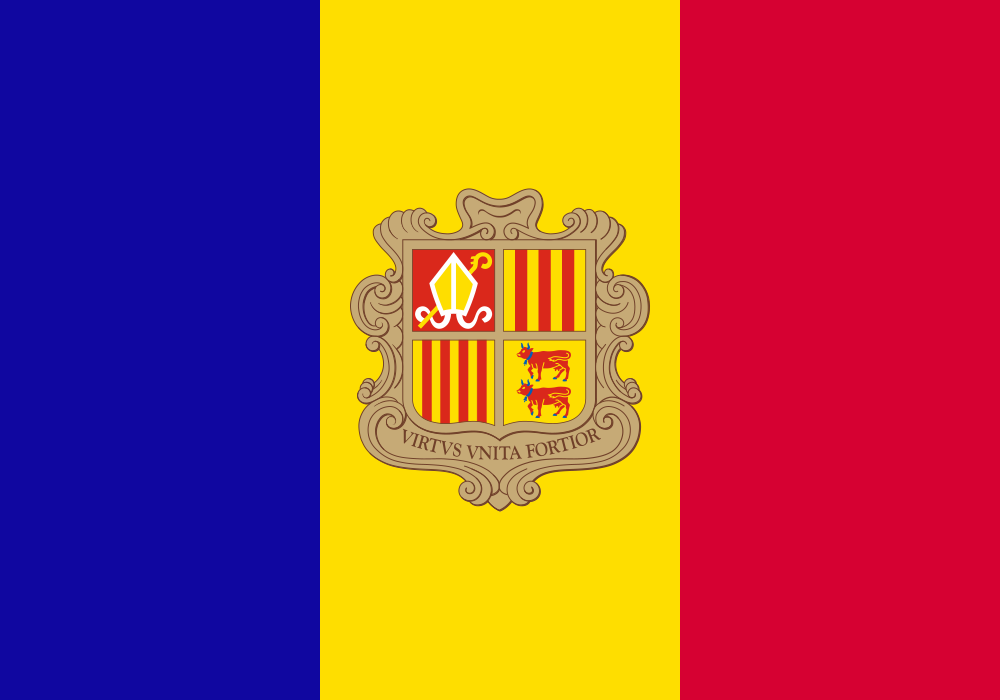
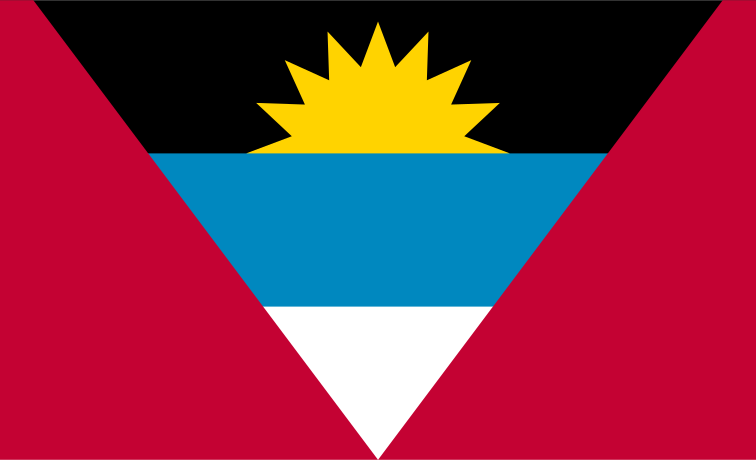
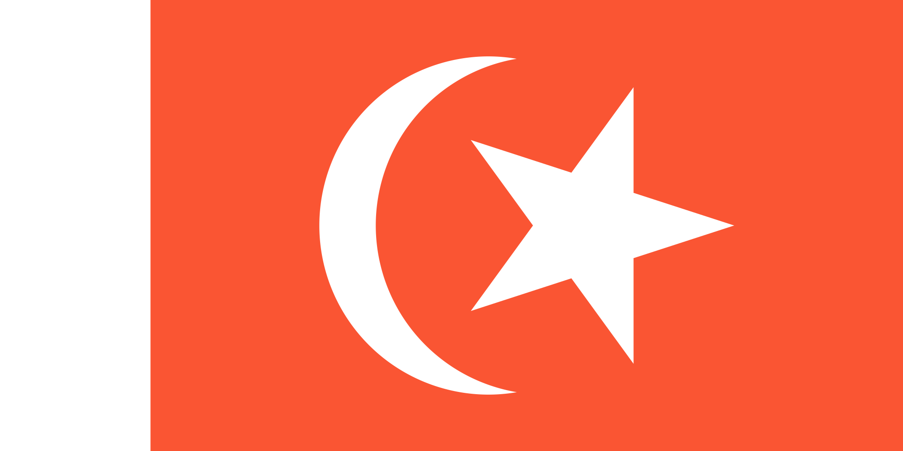
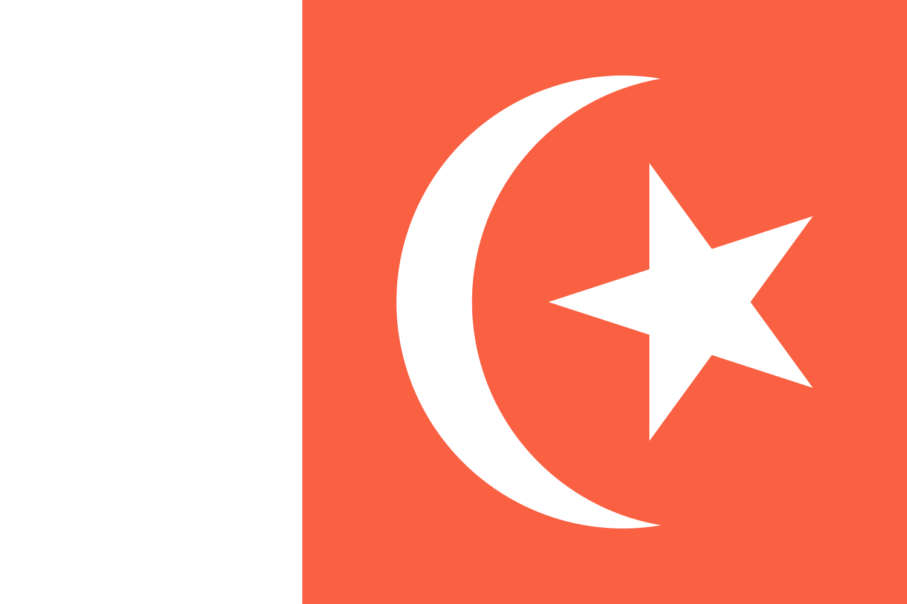

# Countries

## Officially Assigned

| Country | ISO 3166-1 alpha-2 | Flag Graphical Rules | Flag (National, State and Civil) | Apple | Google | Samsung | Other (if needed) |
| - | - | - | - | - | - | - | - |
| the Principality of Andorra | AD | [Normes Gràfiques](https://www.ompa.ad/images/PDF/normativa-signes/Normes_Grafiques.pdf) | State:  No Civil Flag
| the United Arab Emirates | AE | [Protocals / The United Arab Emirates Flag](https://www.protocol.dubai.ae/ar/protocols-listing/protocols/the-united-arab-emirates-flag/) | National: 
| the Islamic Emirate of Afghanistan Province | AF (De facto) | [(Archive)](https://web.archive.org/web/20221229074727/https://www.alemarah.af/Afghanistan-Flag.png) | National:  |
| the Islamic Republic of Afghanistan Province | AF (De jure) | [Flag of Afghanistan \| Protocol (Archive)](https://web.archive.org/web/20210814090748/https://www.mfa.gov.af/protocol/flag-of-afghanistan.html) | National:  
| Antigua and Barbuda | AG | Flag not clearly defined [Our National Symbols](https://ab.gov.ag/detail_page.php?page=27) [The Museum of Antigua and Barbuda's Facebook photo of the first sewn Antigua and Barbuda flag](https://www.facebook.com/ABMuseum/photos/a.10150414631098032/10162160607288032/?_rdr) [Local Antigua Website](https://antiguanice.com/client.php?id=461&cat=38)| National:   
| Anguilla | AI |
| the Republic of Albania | AL |
| the Republic of Armenia | AM |
| the Republic of Angola | AO |
| Antarctica | AQ |
| the Argentine Republic | AR |
| American Samoa | AS |
| the Republic of Austria | AT | 
| the Commonwealth of Australia | AU |
| the Country of Aruba | AW |
| Åland | AX |
| the Republic of Azerbaijan | AZ |
| Bosnia and Herzegovina | BA |
| Barbados | BB |
| the People's Republic of Bangladesh | BD |
| the Kingdom of Belgium | BE |
| Burkina Faso | BF |
| the Republic of Bulgaria | BG |
| the Kingdom of Bahrain | BH |
| the Republic of Burundi | BI |
| the Republic of Benin | BJ |
| the Collectivity of Saint-Barthélemy | BL |
| Bermuda | BM |
| Brunei Darussalam | BN |
| the Plurinational State of Bolivia | BO |
| Bonaire, Sint Eustatius and Saba | BQ |
| the Federative Republic of Brazil | BR |
| the Commonwealth of The Bahamas | BS |
| the Kingdom of Bhutan | BT |
| Bouvet Island | BV |
| the Republic of Botswana | BW |
| the Republic of Belarus | BY |
| Belize | BZ |
| Canada | CA |
| the Territory of Cocos (Keeling) Islands | CC |
| the Democratic Republic of the Congo | CD |
| the Central African Republic | CF |
| the Republic of the Congo | CG |
| the Swiss Confederation | CH |
| the Republic of Côte d'Ivoire | CI |
| the Cook Islands | CK |
| the Republic of Chile | CL |
| the Republic of Cameroon | CM |
| the People's Republic of China | CN |
| the Republic of Colombia | CO |
| the Republic of Costa Rica | CR |
| the Republic of Cuba | CU |
| the Republic of Cabo Verde | CV |
| the Country of Curaçao | CW |
| the Territory of Christmas Island | CX |
| the Republic of Cyprus | CY |
| the Czech Republic | CZ |
| the Federal Republic of Germany | DE |
| the Republic of Djibouti | DJ |
| the Kingdom of Denmark | DK |
| the Commonwealth of Dominica | DM |
| the Dominican Republic | DO |
| the People's Democratic Republic of Algeria | DZ | |
| the Republic of Ecuador | EC |
| the Republic of Estonia | EE |
| the Arab Republic of Egypt | EG |
| the Sahrawi Arab Democratic Republic | EH |
| the State of Eritrea | ER |
| the Kingdom of Spain | ES |
| the Federal Democratic Republic of Ethiopia | ET |
| the Republic of Finland | FI |
| the Republic of Fiji | FJ |
| the Falkland Islands | FK |
| the Federated States of Micronesia | FM |
| the Faroe Islands | FO |
| the French Republic | FR |
| the Gabonese Republic | GA |
| the United Kingdom of Great Britain and Northern Ireland | GB |
| Grenada | GD |
| Georgia | GE |
| Guyane | GF |
| the Bailiwick of Guernsey | GG |
| the Republic of Ghana | GH |
| Gibraltar | GI |
| Greenland | GL |
| the Republic of The Gambia | GM |
| the Republic of Guinea | GN |
| Guadeloupe | GP |
| the Republic of Equatorial Guinea | GQ |
| the Hellenic Republic | GR |
| South Georgia and the South Sandwich Islands | GS |
| the Republic of Guatemala | GT |
| Guam | GU |
| the Republic of Guinea-Bissau | GW |
| the Co-operative Republic of Guyana | GY |
| the Hong Kong Special Administrative Region of China | HK |
| the Territory of Heard Island and McDonald Islands | HM |
| the Republic of Honduras | HN |
| the Republic of Croatia | HR |
| the Republic of Haiti | HT |
| Hungary | HU |
| the Republic of Indonesia | ID |
| Ireland | IE |
| the State of Israel | IL |
| the Isle of Man | IM |
| the Republic of India | IN |
| the British Indian Ocean Territory | IO |
| the Republic of Iraq | IQ |
| the Islamic Republic of Iran | IR |
| Iceland | IS |
| the Italian Republic | IT |
| the Bailiwick of Jersey | JE |
| Jamaica | JM |
| the Hashemite Kingdom of Jordan | JO |
| Japan | JP |
| the Republic of Kenya | KE |
| the Kyrgyz Republic | KG |
| the Kingdom of Cambodia | KH |
| the Republic of Kiribati | KI |
| the Union of the Comoros | KM |
| the Federation of Saint Kitts and Nevis | KN |
| the Democratic People's Republic of Korea | KP |
| the Republic of Korea | KR |
| the State of Kuwait | KW |
| the Cayman Islands | KY |
| the Republic of Kazakhstan | KZ |
| the Lao People's Democratic Republic | LA |
| the Lebanese Republic | LB |
| Saint Lucia | LC |
| the Principality of Liechtenstein | LI |
| the Democratic Socialist Republic of Sri Lanka | LK |
| the Republic of Liberia | LR |
| the Kingdom of Lesotho | LS |
| the Republic of Lithuania | LT |
| the Grand Duchy of Luxembourg | LU |
| the Republic of Latvia | LV |
| the State of Libya | LY |
| the Kingdom of Morocco | MA |
| the Principality of Monaco | MC |
| the Republic of Moldova | MD |
| Montenegro | ME |
| the Collectivity of Saint-Martin | MF |
| the Republic of Madagascar | MG |
| the Republic of the Marshall Islands | MH |
| the Republic of North Macedonia | MK |
| the Republic of Mali | ML |
| the Republic of the Union of Myanmar | MM |
| Mongolia | MN |
| the Macao Special Administrative Region of China | MO |
| the Commonwealth of the Northern Mariana Islands | MP |
| Martinique | MQ |
| the Islamic Republic of Mauritania | MR |
| Montserrat | MS |
| the Republic of Malta | MT |
| the Republic of Mauritius | MU |
| the Republic of Maldives | MV |
| the Republic of Malawi | MW |
| the United Mexican States | MX |
| Malaysia | MY |
| the Republic of Mozambique | MZ |
| the Republic of Namibia | NA |
| New Caledonia | NC |
| the Republic of the Niger | NE |
| the Territory of Norfolk Island | NF |
| the Federal Republic of Nigeria | NG |
| the Republic of Nicaragua | NI |
| the Kingdom of the Netherlands | NL |
| the Kingdom of Norway | NO |
| the Federal Democratic Republic of Nepal | NP |
| the Republic of Nauru | NR |
| Niue | NU |
| New Zealand | NZ |
| the Sultanate of Oman | OM |
| the Republic of Panama | PA |
| the Republic of Peru | PE |
| Overseas Lands of French Polynesia | PF |
| the Independent State of Papua New Guinea | PG |
| the Republic of the Philippines | PH |
| the Islamic Republic of Pakistan | PK |
| the Republic of Poland | PL |
| the Overseas Collectivity of Saint-Pierre and Miquelon | PM |
| the Pitcairn, Henderson, Ducie and Oeno Islands | PN |
| the Commonwealth of Puerto Rico | PR |
| the State of Palestine | PS |
| the Portuguese Republic | PT |
| the Republic of Palau | PW |
| the Republic of Paraguay | PY |
| the State of Qatar | QA |
| Réunion | RE |
| Romania | RO |
| the Republic of Serbia | RS |
| the Russian Federation | RU |
| the Republic of Rwanda | RW |
| the Kingdom of Saudi Arabia | SA |
| the Solomon Islands | SB |
| the Republic of Seychelles | SC |
| the Republic of the Sudan | SD |
| the Kingdom of Sweden | SE |
| the Republic of Singapore | SG |
| Saint Helena, Ascension and Tristan da Cunha | SH |
| the Republic of Slovenia | SI |
| Svalbard and Jan Mayen | SJ |
| the Slovak Republic | SK |
| the Republic of Sierra Leone | SL |
| the Republic of San Marino | SM |
| the Republic of Senegal | SN |
| the Federal Republic of Somalia | SO |
| the Republic of Suriname | SR |
| the Republic of South Sudan | SS |
| the Democratic Republic of São Tomé and Príncipe | ST |
| the Republic of El Salvador | SV |
| Sint Maarten | SX |
| the Syrian Arab Republic | SY |
| the Kingdom of Eswatini | SZ |
| the Turks and Caicos Islands | TC |
| the Republic of Chad | TD |
| the French Southern and Antarctic Lands | TF |
| the Togolese Republic | TG |
| the Kingdom of Thailand | TH |
| the Republic of Tajikistan | TJ |
| Tokelau | TK |
| the Democratic Republic of Timor-Leste | TL |
| Turkmenistan | TM |
| the Republic of Tunisia | TN |
| the Kingdom of Tonga | TO |
| the Republic of Türkiye | TR |
| the Republic of Trinidad and Tobago | TT |
| Tuvalu | TV |
| the Republic of China | TW |
| the United Republic of Tanzania | TZ |
| Ukraine | UA |
| the Republic of Uganda | UG |
| United States Pacific Island Wildlife Refuges, Navassa Island, and Wake Island | UM |
| the United States of America | US |
| the Oriental Republic of Uruguay | UY |
| the Republic of Uzbekistan | UZ |
| the Holy See | VA |
| Saint Vincent and the Grenadines | VC |
| the Bolivarian Republic of Venezuela | VE |
| the Virgin Islands | VG |
| the Virgin Islands of the United States | VI |
| the Socialist Republic of Viet Nam | VN |
| the Republic of Vanuatu | VU |
| the Territory of the Wallis and Futuna Islands | WF |
| the Independent State of Samoa | WS |
| the Republic of Yemen | YE |
| the Department of Mayotte | YT |
| the Republic of South Africa | ZA |
| the Republic of Zambia | ZM |
| the Republic of Zimbabwe | ZW |

## Exceptional Reserved

| Country | ISO 3166-1 alpha-2 | Flag Graphical Rules | Flag (National, State and Civil) | Apple | Google | Samsung | Other (if needed) |
| - | - | - | - | - | - | - | - |
| Ascension Island | AC |
| Clipperton Island | CP |
| Sark | CQ |
| Diego Garcia | DG |
| Ceuta, Melilla | EA |
| the European Union | EU |
| the Eurozone | EZ |
| Metropolitan France | FX |
| the Canary Islands | IC |
| the Union of Soviet Socialist Republics | SU |
| Tristan da Cunha | TA |
| the United Kingdom of Great Britain and Northern Ireland | UK |
| the United Nations | UN |

## Commonly Assigned

| Country | ISO 3166-1 alpha-2 | Flag Graphical Rules | Flag (National, State and Civil) | Apple | Google | Samsung | Other (if needed) |
| - | - | - | - | - | - | - | - |
| the Republic of Kosovo | XK |

## User Assigned

| Country | ISO 3166-1 alpha-2 | Flag Graphical Rules | Flag (National, State and Civil) | Apple | Google | Samsung | Other (if needed) |
| - | - | - | - | - | - | - | - |
| the Republic of Abkhazia | XA (Used by Russia) |
| the Republic of South Ossetia | XO (Used by Russia) |

## No Code

| Country | ISO 3166-1 alpha-2 | Flag Graphical Rules | Flag (National, State and Civil) | Apple | Google | Samsung | Other (if needed) |
| - | - | - | - | - | - | - | - |
| the Turkish Republic of Northern Cyprus | (CT.TR, used by Turkey) |
| the Republic of Somaliland | |
| the Sovereign Military Hospitaller Order of Saint John of Jerusalem, of Rhodes and of Malta | |
| the Pridnestrovian Moldavian Republic (Transnistria) | |

# Subdivisions

| Subdivision | ISO 3166-2 | Flag Graphical Rules | Flag (National, State and Civil) | Apple | Google | Samsung | Other (if needed) |
| - | - | - | - | - | - | - | - |
| Comú de Canillo | AD-02 | No flag or Needs Evidence of a Flag | |
| Comú d'Encamp | AD-03 | No flag or Needs Evidence of a Flag | |
| Comú de La Massana | AD-04 | No flag or Needs Evidence of a Flag | |
| Comú d'Ordino | AD-05 | No flag or Needs Evidence of a Flag | |
| Comú de Sant Julià de Lòria | AD-06 | No flag or Needs Evidence of a Flag | |
| Comú d'Andorra la Vella | AD-07 | No flag or Needs Evidence of a Flag | |
| Comú Escaldes-Engordany | AD-08 | No flag or Needs Evidence of a Flag | |
| Imārat ‘Ajmān | AE-AJ | [Coat of Arms on the Ajman Museum](https://upload.wikimedia.org/wikipedia/commons/1/1b/The_Ajman_National_Museum_%28Emirate_of_Ajman_UAE%29_-_panoramio.jpg) |  |
| Imārat Abū Z̧aby | AE-AZ | [1969 Stamp](https://upload.wikimedia.org/wikipedia/commons/e/e9/Stamp_of_Abu_Dhabi_-_1969_-_Colnect_625777_-_1_-_National_Flag_-_Surcharged.jpeg) |  |
| Imārat al-Fujayrah | AE-FU | No flag (Needs Evidence of no Flag) | |
| Imārat Ash Shāriqah | AE-SH | [1963 Stamp](https://upload.wikimedia.org/wikipedia/commons/0/03/Sharjah1963-65nosheikh.jpg) |  |
| Imārat Dubayy | AE-DU | [Dubai Museum](https://maps.app.goo.gl/Sv3gvhUw7BJ3HxRk7), [Front flag may be 3:5 instead of 1:2](https://maps.app.goo.gl/259qn6iPDgUmj7xt7). |   |
| Imārat Ra’s al-Khaymah | AE-RK | [Image of flag (Archive)](https://web.archive.org/web/20070314033218/https://www.emirates-islands.org.ae/images/PICS/18.JPG) |  |
| Imārat Umm al-Qaywayn | AE-UQ | Flag not clearly defined [Old car license plates](https://upload.wikimedia.org/wikipedia/commons/1/16/Antiguas_patentes_de_autos_de_Umm_al-Qaywayn%2C_de_la_%C3%A9poca_del_protectorado_brit%C3%A1nico.jpg), [Old passport](https://upload.wikimedia.org/wikipedia/commons/8/8e/Antiguo_pasaporte_del_emirato_de_Umm_al-Qaywayn%3B_%C3%A9poca_del_protectora_brit%C3%A1nico.jpg) |      |
| Badakhshān Province | AF-BDS | No flag or Needs Evidence of a Flag | |
| Bādghīs Province | AF-BDG | No flag or Needs Evidence of a Flag | |
| Baghlān Province | AF-BGL | No flag or Needs Evidence of a Flag | |
| Balkh Province | AF-BAL | No flag or Needs Evidence of a Flag | |
| Bāmyān Province | AF-BAM | No flag or Needs Evidence of a Flag | |
| Dāykundī Province | AF-DAY | No flag or Needs Evidence of a Flag | |
| Farāh Province | AF-FRA | No flag or Needs Evidence of a Flag | |
| Fāryāb Province | AF-FYB | No flag or Needs Evidence of a Flag | |
| Ghaznī Province | AF-GHA | No flag or Needs Evidence of a Flag | |
| Ghōr Province | AF-GHO | No flag or Needs Evidence of a Flag | |
| Helmand Province | AF-HEL | No flag or Needs Evidence of a Flag | |
| Herāt Province | AF-HER | No flag or Needs Evidence of a Flag | |
| Jowzjān Province | AF-JOW | No flag or Needs Evidence of a Flag | |
| Kābul Province | AF-KAB | No flag or Needs Evidence of a Flag | |
| Kandahār Province | AF-KAN | No flag or Needs Evidence of a Flag | |
| Kāpīsā Province | AF-KAP | No flag or Needs Evidence of a Flag | |
| Khōst Province | AF-KHO | No flag or Needs Evidence of a Flag | |
| Kunaṟ Province | AF-KNR | No flag or Needs Evidence of a Flag | |
| Kunduz Province | AF-KDZ | No flag or Needs Evidence of a Flag | |
| Laghmān Province | AF-LAG | No flag or Needs Evidence of a Flag | |
| Lōgar Province | AF-LOG | No flag or Needs Evidence of a Flag | |
| Nangarhār Province | AF-NAN | No flag or Needs Evidence of a Flag | |
| Nīmrōz Province | AF-NIM | No flag or Needs Evidence of a Flag | |
| Nūristān Province | AF-NUR | No flag or Needs Evidence of a Flag | |
| Paktīkā Province | AF-PKA | No flag or Needs Evidence of a Flag | |
| Paktiyā Province | AF-PIA | No flag or Needs Evidence of a Flag | |
| Panjshayr Province | AF-PAN | No flag or Needs Evidence of a Flag | |
| Parwān Province | AF-PAR | No flag or Needs Evidence of a Flag | |
| Samangān Province | AF-SAM | No flag or Needs Evidence of a Flag | |
| Sar-e Pul Province | AF-SAR | No flag or Needs Evidence of a Flag | |
| Takhār Province | AF-TAK | No flag or Needs Evidence of a Flag | |
| Uruzgān Province | AF-URU | No flag or Needs Evidence of a Flag | |
| Wardak Province | AF-WAR | No flag or Needs Evidence of a Flag | |
| Zābul Province | AF-ZAB | No flag or Needs Evidence of a Flag | |
| AG-03 | Parish of Saint George | No flag or Needs Evidence of a Flag |
| AG-04 | Parish of Saint John | No flag or Needs Evidence of a Flag |
| AG-05 | Parish of Saint Mary | No flag or Needs Evidence of a Flag |
| AG-06 | Parish of Saint Paul | No flag or Needs Evidence of a Flag |
| AG-07 | Parish of Saint Peter | No flag or Needs Evidence of a Flag |
| AG-08 | Parish of Saint Philip | No flag or Needs Evidence of a Flag |
| AG-10 | Barbuda | Barbuda Council flag not included, No flag or Needs Evidence of a Flag|
| AG-11 | Redonda | Kingdom of Redonda flag not included, No flag or Needs Evidence of a Flag |